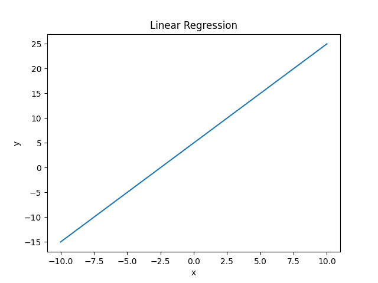
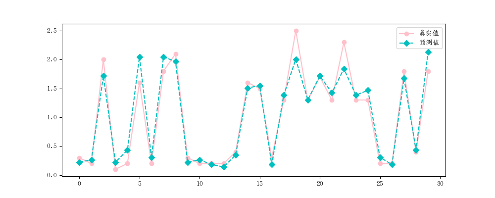
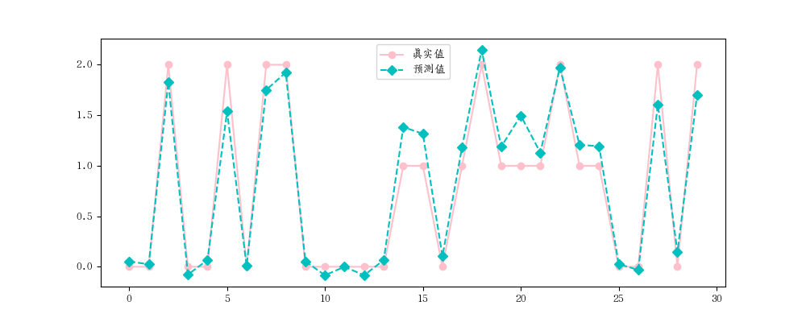

## 模型的概念

在 Python 中，模型是指用来表示和处理数据的抽象概念。模型可以是数学模型、统计模型、机器学习模型等，用于描述数据之间的关系、预测未知数据或进行决策。 
 
在机器学习中，模型是通过训练算法从数据中学习得到的。它可以是分类模型、回归模型、聚类模型等，用于对未知数据进行分类、预测或者分组。模型可以由各种算法实现，如线性回归、决策树、支持向量机、神经网络等。 
 
在使用模型时，通常需要进行训练和评估。训练是指使用已知数据来调整模型的参数或权重，使其能够更好地拟合数据。评估是指使用测试数据来评估模型的性能和准确度。 
 
Python 中有许多流行的机器学习库和框架，如scikit-learn、TensorFlow、PyTorch等，它们提供了丰富的模型实现和工具，方便用户在Python中构建和使用各种类型的模型。

## 线性关系
两个变量之间存在一次方函数关系，就称它们之间存在线性关系。更通俗一点讲，如果把这两个变量分别作为点的横坐标与纵坐标，其图像是平面上的一条直线，则这两个变量之间的关系就是线性关系。

**<font color="yello">下面哪个是线性关系？（C）</font>**      
A: $y= e^x + 8x$     
B: $y = x^2 - 6x + 3$   
C: $y = 8x -2$    
D: $y = sinx$   

## 模型拟合
模型拟合是指通过调整模型的参数或权重，使其能够最好地拟合给定的数据。在机器学习和统计学中，模型拟合是一个重要的步骤，它的目标是找到最优的模型参数，使得模型能够最准确地预测或描述数据。 
 
在模型拟合过程中，通常会使用训练数据来调整模型的参数，使得模型的预测结果与实际观测值尽可能接近。这可以通过最小化损失函数或最大化似然函数来实现。具体的拟合方法和算法取决于所使用的模型类型，例如线性回归、逻辑回归、神经网络等。 
 
模型拟合的目标是找到一个能够在训练数据上表现良好，并且能够在未知数据上泛化的模型。拟合的好坏可以通过评估指标如均方误差（MSE）、准确率、对数似然等来衡量。 
 
总结起来，模型拟合是通过调整模型参数，使其在给定数据上表现最佳的过程。它是机器学习和统计学中重要的一步，用于构建准确、可靠的预测模型。


## 线性回归模型

$y = w*x + b$

线性回归是一种用于建立变量之间线性关系的统计模型。它假设自变量与因变量之间存在线性关系，并通过最小化残差平方和来拟合数据。线性回归适用于只有一个自变量的情况。


### 实例一：简单线性  
比如: y = 2x + 5 ,当 y = 0 时， x = -$\frac{5}{2}$ ; 当 x = 0 时， y = 5 。该例中 y 是随 x 的值变动而变动，所以又称 x 为 自变量，y 为 因变量：

```python
import numpy as np
import matplotlib.pyplot as plt

# 生成 x 值
x = np.linspace(-10, 10, 100)

# 计算对应的 y 值
y = 2 * x + 5

# 绘制线性回归图
plt.plot(x, y)

# 添加标题和坐标轴标签
plt.title("Linear Regression")
plt.xlabel("x")
plt.ylabel("y")

# 显示图形
plt.show()
```

如图：      


### 实例二:

```python
import numpy as np
import matplotlib.pyplot as plt
from sklearn.linear_model import LinearRegression
from sklearn.model_selection import  train_test_split
from sklearn.datasets import load_iris
import matplotlib.pyplot as plt
from sklearn.metrics import mean_squared_error, mean_absolute_error, r2_score


iris = load_iris()
# print(iris)

# 指定特征和标签列
x , y = iris.data[:, 2].reshape(-1,1), iris.data[:,3]
# print(x, y)

# 划分训练集和数据集
x_train, x_test, y_train, y_test = train_test_split(x, y, test_size=0.2, random_state=2)

'''
# 随机种子案例
import random

random.seed(5)          # 固定种子数据，如果不加这一行，则打出出来的 num 每执行一次就变化一次，加了之后，不会变化了
num = [random.randint(1,100) for i in range(10]
print(num)
'''

# 建立模型
lr = LinearRegression()

# 拟合
lr.fit(x_train, y_train)

print('权重', lr.coef_)
'''
权重 [0.4145955]
'''

print('截矩', lr.intercept_)
'''
截矩 -0.3568629603559508
'''

所以可以推出公式：
'''
y = 0.4145955x - 0.3568629603559508
'''

# 预测
y_hat = lr.predict(x_test)
print(y_hat[:5])
'''
[0.22357074 0.26503029 1.71611455 0.22357074 0.43086849]
'''

print(y_test[:5])
'''
[0.3 0.2 2.  0.1 0.2]
'''

## 模型评估
plt.rcParams['font.family']='AR PL UKai CN'
plt.figure(figsize=(10, 4))
plt.plot(y_test, label='真实值', color='pink', marker='o')
plt.plot(y_hat, label='预测值', color='c', marker='D', ls = '--')
plt.legend()
plt.show()

# 均方误差
print(mean_absolute_error(y_test, y_hat))
'''
0.1430440743648432
'''

# 平均绝对误差
print(mean_absolute_error(y_test, y_hat))
'''
0.1430440743648432
'''

# 分数(模型打分）
print(r2_score(y_test, y_hat))
'''
0.9368067916048772
'''

print(lr.score(x_test, y_test))
'''
0.9368067916048772
'''
```

图如下：   



## 多元线性回归

多元线性回归是线性回归的扩展，适用于有多个自变量的情况。多元线性回归模型通过考虑多个自变量之间的线性关系来预测因变量。它可以更准确地建模和预测复杂的数据。 
 
在多元线性回归中，每个自变量都有一个对应的系数，表示自变量对因变量的影响程度。模型的目标是找到最优的系数值，使得模型能够最好地拟合数据。多元线性回归还可以通过统计检验来评估自变量的显著性和模型的整体拟合程度。 

$y= w_1 * x_1 + w_2 * x_2 + ... + w_n*x_n + b$

- $x$：影响因数，即特征；
- $w$：每个 x 的影响力度。
- $n$：特征的个数；
- $y$：房屋的价格预测

### 实例一：   

```python
import numpy as np
import matplotlib.pyplot as plt
from sklearn.linear_model import LinearRegression
from sklearn.model_selection import  train_test_split
from sklearn.datasets import load_iris
import matplotlib.pyplot as plt
from sklearn.metrics import mean_squared_error, mean_absolute_error, r2_score

iris = load_iris()

# 指定特征和标签列
x , y = iris.data, iris.target
print(x, y)

# 划分训练集和数据集
x_train, x_test, y_train, y_test = train_test_split(x, y, test_size=0.2, random_state=2)

'''
# 随机种子案例
import random

random.seed(5)          # 固定种子数据，如果不加这一行，则打出出来的 num 每执行一次就变化一次，加了之后，不会变化了
num = [random.randint(1,100) for i in range(10]
print(num)
'''

# 建立模型
lr = LinearRegression()

# 拟合
lr.fit(x_train, y_train)

print('权重', lr.coef_)
'''
权重 [-0.10728636 -0.05501051  0.20173467  0.65733707]
'''

print('截矩', lr.intercept_)
'''
截矩 0.2541845140343175
'''

# 预测
y_hat = lr.predict(x_test)
print(y_hat[:5])
'''
[ 0.0532612   0.02420411  1.82847351 -0.07765928  0.06693756]
'''

print(y_test[:5])
'''
[0 0 2 0 0]
'''

# 模型评估
plt.rcParams['font.family']='AR PL UKai CN'
plt.figure(figsize=(10, 4))
plt.plot(y_test, label='真实值', color='pink', marker='o')
plt.plot(y_hat, label='预测值', color='c', marker='D', ls = '--')
plt.legend()
plt.show()


# 均方误差
print(mean_absolute_error(y_test, y_hat))
'''
0.15846012300682463
'''

# 平均绝对误差
print(mean_absolute_error(y_test, y_hat))
'''
0.15846012300682463
'''

# 分数(模型打分）
print(r2_score(y_test, y_hat))
'''
0.9371534629740856
'''

print(lr.score(x_test, y_test))
'''
0.9371534629740856
'''
```

图如下：    



