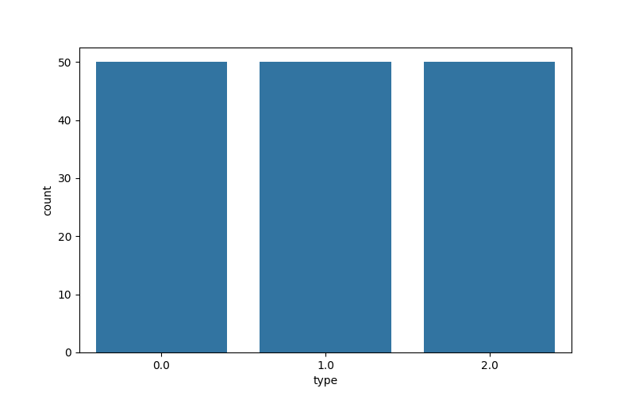
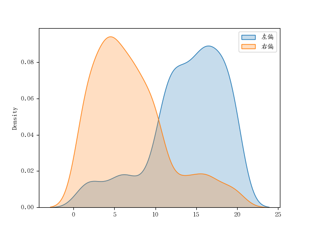

## 频数与频率
频数和频率是统计学中常用的概念，用于描述数据中不同取值或组别出现的次数。 
 
频数（Frequency）指的是某个取值或组别在数据中出现的次数。例如，假设有一个班级的学生身高数据，频数可以表示某个身高值在数据中出现的次数。频数可以用来描述数据的分布情况，帮助我们了解数据中各个取值的重要性或出现的频率。 
 
频率（Frequency）指的是某个取值或组别在数据中出现的相对比例或百分比。频率可以通过将频数除以总样本数来计算得到。频率可以帮助我们比较不同取值或组别之间的相对重要性或出现的相对频率。 
 
举例来说，假设有一个调查问卷，其中包含了对不同年龄段的人口数量进行统计。我们可以计算每个年龄段的频数，即各个年龄段在样本中出现的次数。然后，通过将频数除以总样本数，得到每个年龄段的频率，即各个年龄段在样本中的相对比例。 
 
总结起来，频数是指某个取值或组别在数据中出现的次数，而频率是指某个取值或组别在数据中出现的相对比例或百分比。它们是统计学中用于描述数据分布和比较不同取值或组别之间重要性的重要概念。


### 课堂练习

假设校领导关注与某班级学生的期末考试成绩，我们会怎样进行回报？ (C)

A 某班成绩还可以；     
B 张三 90 分，李四 88 分， ...；     
C 班级平均分 85.2 分，最高分 100 分， 最低分 72 分；    


### 实例 

```python
import numpy as np
import pandas as pd
import matplotlib.pyplot as plt
import seaborn as sns
from sklearn.datasets import load_iris
import warnings


# 忽略警告
warnings.filterwarnings('ignore')

#加载数据
iris = load_iris()
print(iris.data[:10])
'''
[[5.1 3.5 1.4 0.2]
 [4.9 3.  1.4 0.2]
 [4.7 3.2 1.3 0.2]
 [4.6 3.1 1.5 0.2]
 [5.  3.6 1.4 0.2]
 [5.4 3.9 1.7 0.4]
 [4.6 3.4 1.4 0.3]
 [5.  3.4 1.5 0.2]
 [4.4 2.9 1.4 0.2]
 [4.9 3.1 1.5 0.1]]
'''

# 整理成表格形式
data = np.concatenate([iris.data, iris.target.reshape(-1, 1)], axis=1)  # iris.target.reshape(-1, 1) 一维数组升级为 二维
data = pd.DataFrame(data, columns=['sepal length (cm)', 'sepal width (cm)', 'petal lenght (cm)', 'petal width (cm)', 'type'])
print(data)
'''
     sepal length (cm)  sepal width (cm)  ...  petal width (cm)  type
0                  5.1               3.5  ...               0.2   0.0
1                  4.9               3.0  ...               0.2   0.0
2                  4.7               3.2  ...               0.2   0.0
3                  4.6               3.1  ...               0.2   0.0
4                  5.0               3.6  ...               0.2   0.0
..                 ...               ...  ...               ...   ...
145                6.7               3.0  ...               2.3   2.0
146                6.3               2.5  ...               1.9   2.0
147                6.5               3.0  ...               2.0   2.0
148                6.2               3.4  ...               2.3   2.0
149                5.9               3.0  ...               1.8   2.0

[150 rows x 5 columns]
'''

# 频数
fre = data['type'].value_counts()
print(fre)
'''
type
0.0    50
1.0    50
2.0    50
Name: count, dtype: int64
'''

# 频率
perc = fre * 100/ len(data)
print(perc)
'''
type
0.0    33.333333
1.0    33.333333
2.0    33.333333
Name: count, dtype: float64
'''

plt.figure(figsize=(8,5))
sns.countplot(x='type', data=data)
plt.show()
```

图如下：  



## 变量分类

### 类别变量

#### 无序列表变量

#### 有序列表变量


### 数值变量

#### 连续变量

#### 离散变量


## 集中趋势分析


### 均值

公式：$x=\frac{1}{n}\sum_{i=1}^n x_i$

- x：均值;
- $x_i$：数组中每个元素


### 中位数
将一组数据升序排列，位于该组数据最中间位置的值，就是中位数。如果数据个数为偶数，则取中间两个数值的均值


### 纵数
一组数据中出现次数最多的值

### 分位数

```python
# numpy 方式
x = [1, 3, 10, 15, 18, 20, 23, 40]
print(np.quantile(x, q=[0.25, 0.8, 0.9]))
print(np.percentile(x, q=[25, 80, 90])      # 百分比

# pandas 方式
x = [1, 3, 10, 15, 18, 20, 21, 23, 40]
s = pd.Series(x)
s.describe(percentiles=[0.25, 0.8])
```


## 离散程度分析

### 极差
极差指一组数据中，最大值与最小值之差

### 标准差
方差体现的是一组数据中，每个元素与均值偏离的大小

公式： $o^2 = \frac{1}{n-1}\sum_{i=1}^n(x_i-x)^2$

- $x_i$：数组中的每个元素；
- $n$：数组元素的个数；
- $x$：数组中的所有元素的均值


### 方差
标准差为方差的开方

公式：$o = \sqrt{\frac{1}{n-1}\sum_{i=1}^n(x_i-x)^2}$

**说明：**
- 极差的计算非常简单，但是极差没有充分的利用数据信息；
- 当数据较大时，也可以使用 $n$ 代替 $n-1$


#### 实例

```python
f = pd.DataFrame(data = [[93, 98, 89], [94, 95, 91], [93, 93, 93]] ,index = ['li', 'wang', 'zhang'])
print(df)
'''
        0   1   2
li     93  98  89
zhang  94  95  91
wang   93  93  93
'''

# 总分
print(df.sum(axis=1))
'''
li       280
wang     280
zhang    279
dtype: int64
'''

# 方差
print(df.var(axis=1))
'''
li       20.333333
wang      4.333333
zhang     0.000000
dtype: float64
'''
```


## 分布形状
偏度、峰度

### 实例：
```python
## 左偏
t1 = np.random.randint(1, 11, size=100)
# print(t1)
t2 = np.random.randint(11, 21, size=500)
t3 = np.concatenate([t1, t2])
left_skew = pd.Series(t3)


## 右偏
t1 = np.random.randint(1, 11, size=500)
# print(t1)
t2 = np.random.randint(11, 21, size=100)
t3 = np.concatenate([t1, t2])
right_skew = pd.Series(t3)

# 计算偏度
print(left_skew.skew(), right_skew.skew())
'''
-0.92461209597648 0.9437077927633518
'''

sns.kdeplot(left_skew, shade=True, label='左偏')
sns.kdeplot(right_skew, shade=True, label='右偏')
plt.legend()
plt.show()
```

图如下：    
