目前市场大多数智能家居都是选择小米品牌旗下的绿米。我家也不例外。

## 安装小米集成

### 安装 Xiaomi Miot Auto

1.点击左侧菜单栏中的 HACS ，然后在右侧的  `Home Assistant Community Store` 下方的搜索栏中输入关键字 `xiaomi` ,在匹配的结果中点击 `Xiaomi Miot Auto`:
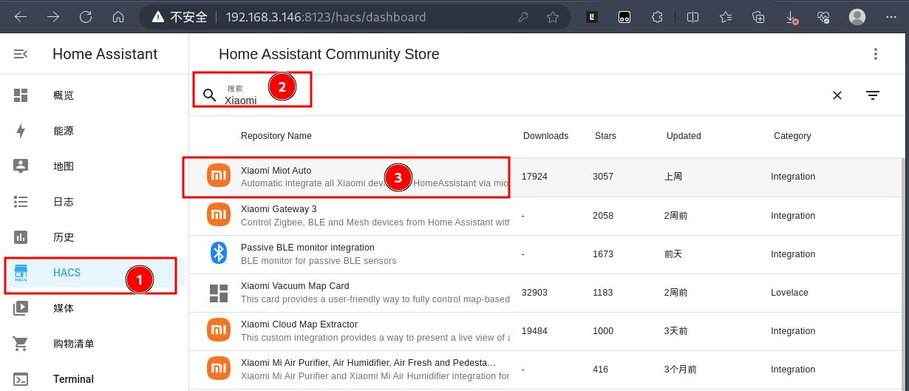

2.进入 `Xiaomi Miot Auto` 页面后，点击右下角的 `DOWNLOAD` 进行安装：
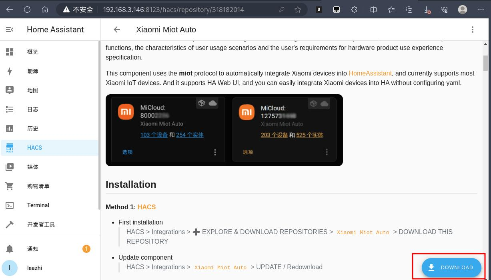

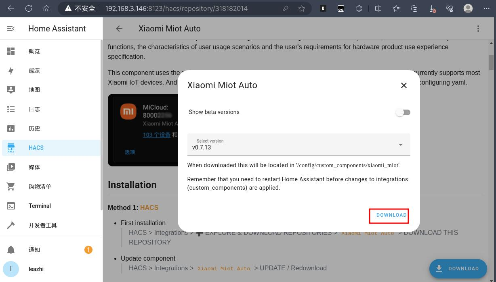

### 集成 Xiaomi Miot Auto

1.安装完成后。点击配置，设备于服务：
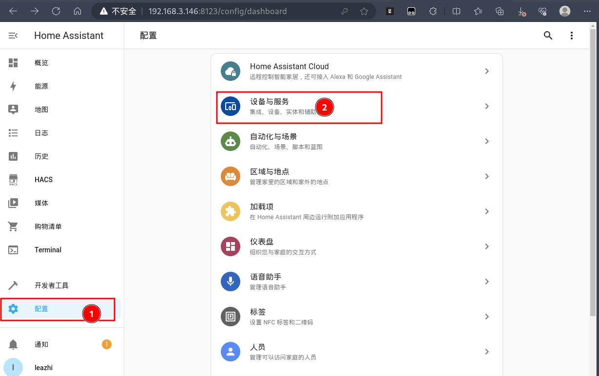

2.进入 设备于服务 页面后，在集成里面此时还看不到安装的 `Xiaomi Miot Auto`，此时点击右下角的添加集成：
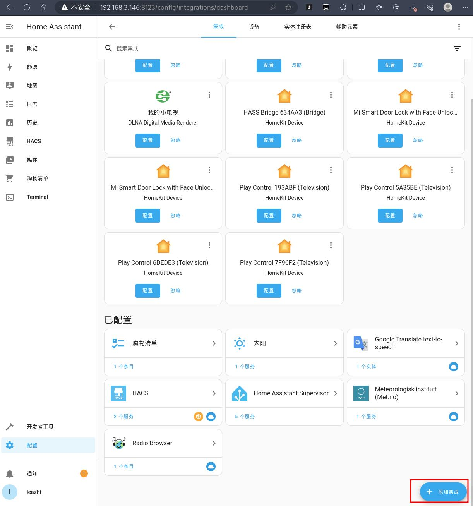

3.在弹出的 选择品牌 窗口搜索栏中输入关键字 xiaomi, 点击匹配到的`Xiaomi Miot Auto`
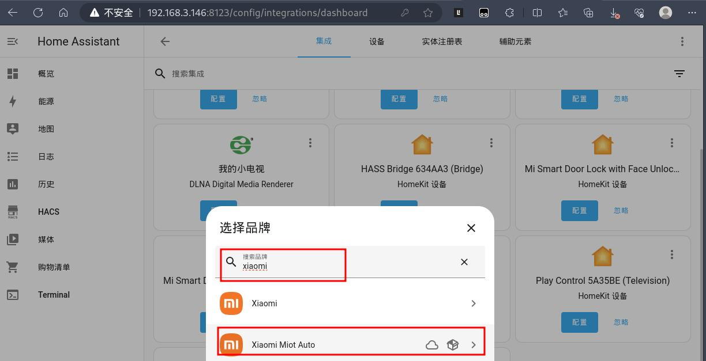

4.在弹出的选择操作窗口选择  Add devices using Mi Account(帐号集成) ，然后点击下一步：
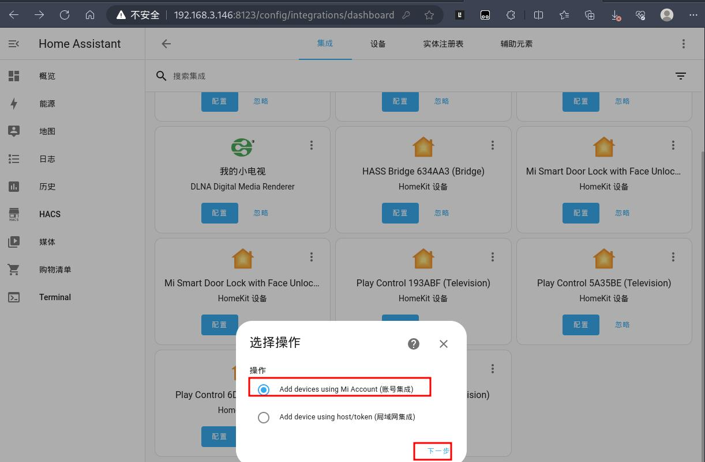

5.在新的 `Xiaomi Miot Auto` 窗口中，输入你自己的小米帐号密码进行登录：
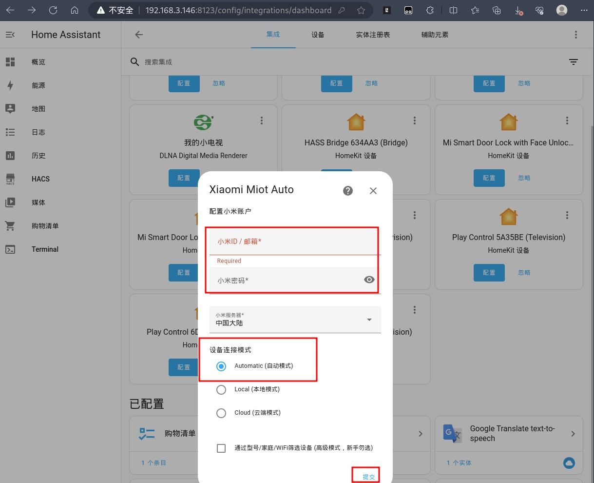

6.帐号验证通过后，就会进入 筛选设备 窗口。**注意**：仔细阅读下给的提示信息，根据自己的需求选择。由于我家全屋好多设备，这里我就选择包含方式（后续也可以根据需求自行添加），然后在下面的设备列表中选择要控制的智能设备。最后点击提交：
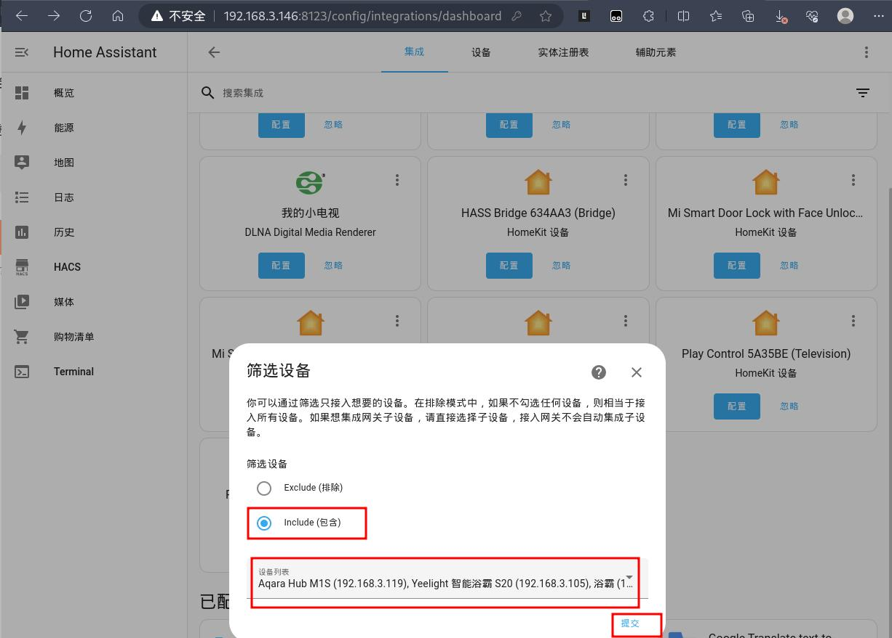

7.此时稍等几秒，可以看到会自动跳转到成功窗口，且上一步包含的设备也会按照在米家 APP 上规划的区域进行显示。最后点击完成即可！：
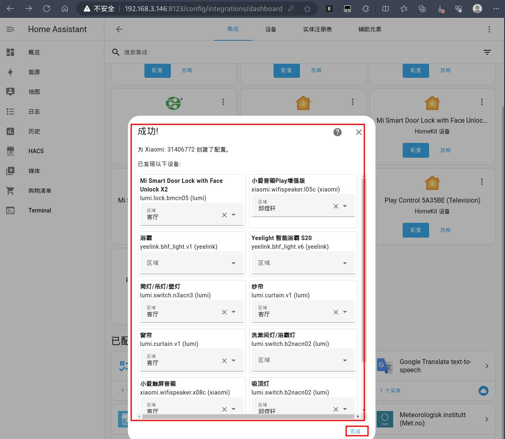

8.回到 设备与服务 页面后，可以在集成属性中看到 `Xiaomi Miot Auto` 已经被集成过来了：
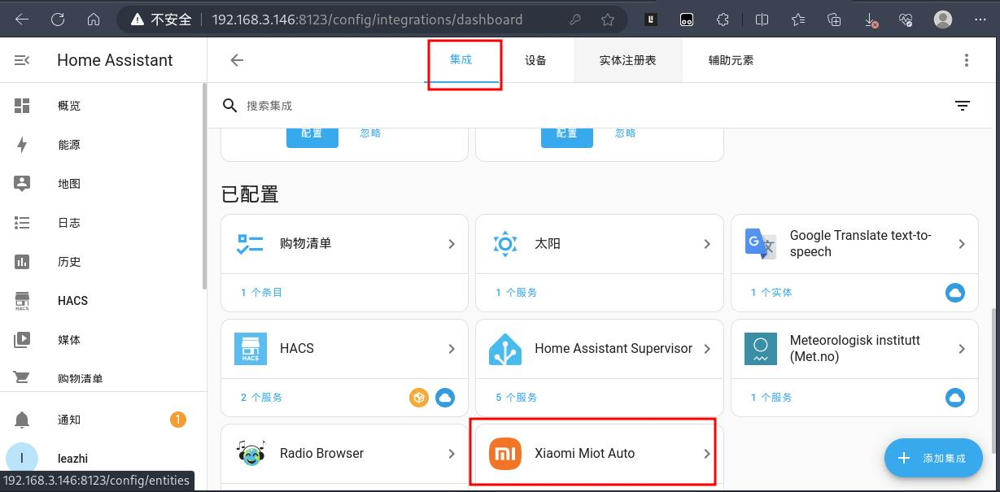

### 添加设备

