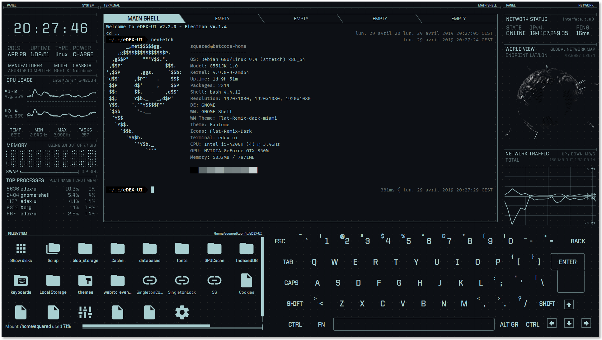

先来看作者给出的效果图：
      


## 系统环境
- 系统环境：23.10 (Mantic Minotaur)
- 内核版本：6.5.0-9-generic #9-Ubuntu SMP PREEMPT_DYNAMIC Sat Oct  7 01:35:40 UTC 2023 x86_64 x86_64 x86_64 GNU/Linux

## 项目部署

eDEX-UI 项目地址：https://github.com/GitSquared/edex-ui

### 部署方式：

#### 方式一：直接使用 Release 封装好的包进行启动

1.安装依赖包,否则运行 eDEX-UI 会报：`dlopen(): error loading libfuse.so.2` 的错误：
```bash
sudo apt install libfuse2
```

2.从 [eDEX-UI Release 页面下载](https://github.com/GitSquared/edex-ui/releases) 对应平台的包到本地(我这里是 x86_64 平台，所以直接下载 eDEX-UI-Linux-x86_64.AppImage 到本地的 ~/Downloads 目录):

3.下载完成后，赋予 `eDEX-UI-Linux-x86_64.AppImage` 可执行权限：
```bash
sudo chmod +x ~/Downloads/eDEX-UI-Linux-x86_64.AppImage
```

4.接下来，进入 ~/Downloads 目录，执行命令 `./eDEX-UI-Linux-x86_64.AppImage` 启动 eDEX-UI:
```bash
leazhi@ubuntu2210:/data/gitlab$ cd ~/Downloads/
leazhi@ubuntu2210:~/Downloads$ ./eDEX-UI-Linux-x86_64.AppImage 
▶  start     Starting eDEX-UI v2.2.8
ℹ  info      With Node 14.16.0 and Electron 12.2.2
ℹ  info      Renderer is Chrome 89.0.4389.128
▶  Startup   Initialized timer...
ℹ  info      Base config dir is /home/leazhi/.config/eDEX-UI
☐  pending   Mirroring internal assets...
☐  pending   Loading settings file...
☐  pending   Resolving shell path...
ℹ  info      Shell found at /usr/bin/bash
✔  success   Settings loaded!
☐  pending   Creating new terminal process on port 3000
✔  success   Terminal back-end initialized!
☐  pending   Starting multithreaded calls controller...
✔  success   Multithreaded controller ready
ℹ  info      Creating window...
libva error: /usr/lib/x86_64-linux-gnu/dri/i965_drv_video.so init failed
ℹ  info      Multithread worker started at 1307173
ℹ  info      Multithread worker started at 1307170
ℹ  info      Multithread worker started at 1307171
ℹ  info      Multithread worker started at 1307172
☒  complete  Frontend window created!
…  watching  Waiting for frontend connection...
ℹ  info      Multithread worker started at 1307174
ℹ  info      Multithread worker started at 1307176
ℹ  info      Multithread worker started at 1307175
✔  success   Connected to frontend!
◼  Startup   Timer run for: 12.03s
ℹ  info      Resized TTY to  184 040
ℹ  info      UpdateChecker: Running latest version.
```


#### 方式二：使用源码编译安装

1.安装配置好 nodejs 环境，详细安装配置请参考：[nodejs 之 http-server 模块的安装](https://hexo.linuser.com/2023/09/10/a5ceef49cc78/) 中的 nodejs 安装部分

2.将 edex-ui 项目克隆到本地的：
```bash
git clone https://github.com/GitSquared/edex-ui.git
```

3.进入克隆目录：
```bash
cd edex-ui
```

4.执行：
```bash
npm install 
npm run build-linux
```

### 创建快捷启动方式

1.创建目录：
```bash
sudo mkdir -p /usr/local/edex-ui
```

2.将下载好的 eDEX-UI-Linux-x86_64.AppImage 移动到上面创建的目录中：
```bash
sudo mv ~/Downloads/eDEX-UI-Linux-x86_64.AppImage /usr/local/edex-ui/
```

3.从网上下载一个自己喜欢的图片放到 /usr/local/edex-ui 目录中；

4.将目录 /usr/local/edex-ui 下的所有文件都赋予 x 权限;
```bash
sudo chmod +x /usr/local/edex-ui/*
```

5.在 /usr/share/applications/ 目录下创建 edex-ui.desktop 文件，内容为：
```bash
[Desktop Entry]
Encoding=UTF-8
Type=Application
Name=edex-ui
Exec=/usr/local/edex-ui/eDEX-UI-Linux-x86_64.AppImage
Icon=/usr/local/edex-ui/hacker.jpeg
Terminal=false
Categories=navicat;
```

6.按键盘上的 田字键 ，搜索 edex 关键字，就可以使用快捷方式打开 edex-ui 了！

### 主题配置

主题配置主要修改 `~/.config/eDEX-UI` 目录下的 settings.json 文件，默认主题为 `tron`，将关键字 "theme" 的配置修改为 `~/.config/eDEX-UI/themes` 下的文件名，比如为这里修改成了：
```json
{
    "shell": "bash",
    "shellArgs": "",
    "cwd": "/home/leazhi/.config/eDEX-UI",
    "keyboard": "en-US",
    "theme": "tron-disrupted",
    "termFontSize": 15,
    "audio": true,
    "audioVolume": 1,
    "disableFeedbackAudio": false,
    "clockHours": 24,
    "pingAddr": "1.1.1.1",
    "port": 3000,
    "nointro": false,
    "nocursor": false,
    "forceFullscreen": true,
    "allowWindowed": false,
    "excludeThreadsFromToplist": true,
    "hideDotfiles": false,
    "fsListView": false,
    "experimentalGlobeFeatures": false,
    "experimentalFeatures": false
}
``` 

如果想要再炫一点，可以安装下骇客雨包  `cmatrix` ，然后在打开 edex-ui 界面后，在 MAIN-bash 里面执行 `cmatrix` 命令即可！